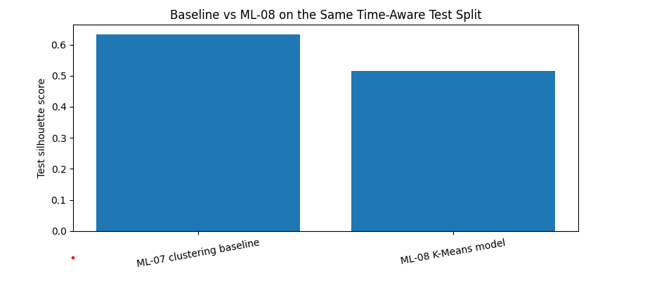
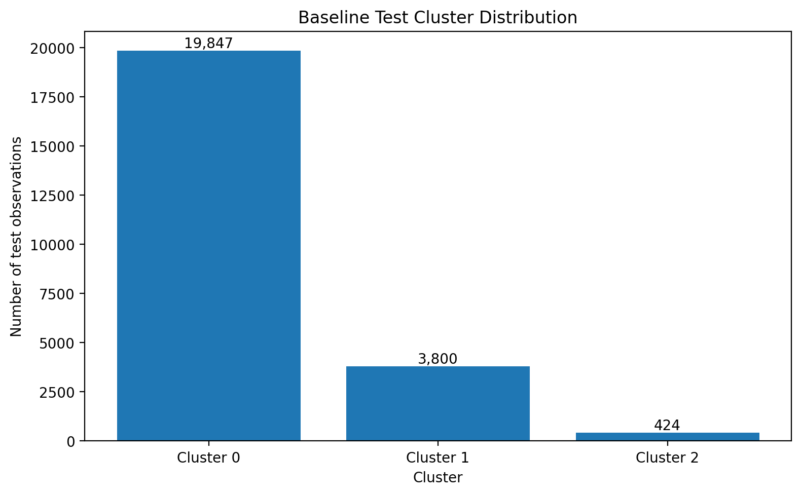

# Observed Search-Performance Archetypes for Content Review and Prioritization

**Author:** Nagham Zidiah
**Track:** Machine Learning
**Lane:** Structured Content Archetype Clustering
**Data period:** March 2026
**Repository:** NaghamZidiah/FlyRank-ML-Internship

---

## Abstract

This study asks whether observed search-performance signals can be used to group content-page observations into clear performance archetypes that support content review and prioritization. Using a 100,000-observation sample from the March 2026 FlyRank internship warehouse, the analysis applies K-Means clustering to Google Search Console impressions, clicks, and average position. A transparent raw-feature baseline is compared with an ML-08 representation using log-transformed impressions and clicks under the same time-aware validation design. On the held-out March 25–31 test period, the raw-feature baseline achieved a silhouette score of 0.6325, while the ML-08 representation achieved 0.5150. The result indicates that the log-transformed representation did not improve cluster separation in this validation window, while the baseline produced three observable search-performance profiles that can support human review and prioritization.

---

## 1. Introduction and Problem Statement

Content teams often need to decide which pages deserve closer review, monitoring, or improvement. When a portfolio contains many content-page observations, manually examining every page using the same level of attention is inefficient.

This project investigates whether simple observed search-performance signals can be used to organize content observations into interpretable performance archetypes.

The research question is:

> **Can observed search-performance signals be used to group content-page observations into clear performance archetypes that support content review and prioritization?**

The intended decision is not to automatically change or rank content. Instead, the analysis provides a directional decision-support framework that can help a content team identify groups of observations with similar measured search-performance patterns and decide where human review may be useful.

The unit of analysis is a content-page performance observation for a reporting date. The output is a set of clusters interpreted through their observed search-performance profiles.

The main cost of a wrong call is prioritization error: spending review effort on observations that do not need attention or overlooking observations that may deserve investigation. For this reason, the clustering output is treated as a review aid rather than an automated editorial decision.

---

## 2. Data

### Data source

The analysis uses the March 2026 release of the FlyRank internship warehouse, specifically the `fact_content_daily_performance` table.

The working sample contains **100,000 observations** covering the period:

**March 1, 2026 – March 31, 2026**

The sample was selected deterministically using a hash-based ordering of content and reporting date, making the selection reproducible.

### Included signals

The analysis uses three Google Search Console performance signals:

* `gsc_impressions`
* `gsc_clicks`
* `gsc_avg_position`

Rows with missing values for these fields were excluded. Observations with zero impressions were also excluded because they do not provide a positive visibility observation for the selected analysis.

### Excluded information

Client and content identifiers are retained only for record tracking and analysis grouping. They are not used as model features.

Label-derived fields such as `trend_direction` and `trend_pct` are excluded from the feature set because they are derived from performance changes and could introduce leakage into an analysis intended to discover performance structure from current observed signals.

Client names, domains, private queries, credentials, and raw private exports are not included in this report.

---

## 3. Methodology

### 3.1 Clustering approach

This project uses the **Structured Content Archetype Clustering** lane.

The task is unsupervised because there is no predefined target label representing the desired content archetypes. Instead, K-Means is used to identify groups based on observed search-performance features.

The analysis assumes that recurring combinations of search-performance signals can be summarized into interpretable performance profiles.

### 3.2 Baseline

The baseline is a transparent K-Means clustering approach using the raw features:

* impressions
* clicks
* average position

The baseline uses:

* `k = 3`
* `random_state = 42`
* `n_init = 10`

The baseline provides a simple reference against which the ML-08 feature representation can be evaluated.

### 3.3 ML-08 representation

The ML-08 model uses the same K-Means algorithm and the same three-cluster setting.

The feature representation is:

* `log_impressions = log1p(impressions)`
* `log_clicks = log1p(clicks)`
* `gsc_avg_position`

The log transformation was introduced to reduce the influence of the strong right-skew commonly present in impressions and clicks.

This comparison isolates the effect of the feature representation while keeping the clustering algorithm, number of clusters, random seed, and evaluation metric consistent.

### 3.4 Time-aware validation

The evaluation uses a time-aware split rather than a random split.

Training observations cover:

**March 1–24, 2026**

Held-out test observations cover:

**March 25–31, 2026**

The training set contains **75,929 observations**, while the held-out test set contains **24,071 observations**.

Feature scaling is fitted using the training data only and then applied to the held-out test data.

This design avoids fitting the clustering model or scaler using observations from the later evaluation period.

### 3.5 Evaluation metric

The primary metric is the **silhouette score**.

The silhouette score measures how clearly observations are separated from neighboring clusters. A higher score indicates stronger separation under the selected feature representation.

It is used here as a measure of cluster separation. It is **not** treated as predictive accuracy, business impact, or evidence of causal ranking effects.

### 3.6 Leakage control

The final feature set contains only:

* `log_impressions`
* `log_clicks`
* `gsc_avg_position`

The following types of information were deliberately excluded:

* client identifiers as model features;
* content identifiers as model features;
* `trend_direction`;
* `trend_pct`;
* other label-derived or decision-derived fields.

The goal is to ensure that the clusters are formed from the selected observed search-performance signals rather than information derived from a target or downstream decision.

---

## 4. Results

### 4.1 Baseline vs ML-08

Both approaches were evaluated on the **same held-out March 25–31 test observations**, using the same `k=3` setting and the same silhouette metric.

| Method                    | Feature representation                  |  k | Test silhouette |        Change vs baseline |
| ------------------------- | --------------------------------------- | -: | --------------: | ------------------------: |
| ML-07 clustering baseline | Raw impressions + clicks + position     |  3 |      **0.6325** |                    0.0000 |
| ML-08 K-Means model       | Log impressions + log clicks + position |  3 |      **0.5150** | approximately **-0.1175** |

The ML-08 representation produced a lower test silhouette score than the transparent raw-feature baseline.

Therefore, under this time-aware validation design, the log transformation did **not** improve cluster separation.

This is an observed comparison for the selected March 2026 sample and validation window. It does not establish that the baseline will always outperform the transformed representation on other datasets or periods.

### Baseline vs ML-08 silhouette comparison

### 4.2 Baseline cluster profiles

The baseline produced three observable profiles on the held-out test period.

| Cluster | Mean impressions | Mean clicks | Mean average position |
| ------: | ---------------: | ----------: | --------------------: |
|       0 |           65.389 |       0.160 |                 8.701 |
|       1 |           32.324 |       0.020 |                56.208 |
|       2 |        1,402.870 |       5.356 |                 8.274 |

These profiles describe measured differences in search-performance signals.

**Cluster 2 — High-visibility profile**

Cluster 2 has the highest mean impressions and clicks, with a mean average position of 8.274. It represents the strongest observed search-performance profile in this analysis.

**Cluster 0 — Moderate-visibility profile**

Cluster 0 has substantially lower visibility and clicks than Cluster 2 while maintaining a relatively similar mean average position of 8.701.

**Cluster 1 — Low-visibility / weaker-position profile**

Cluster 1 has the lowest mean impressions and clicks and a much higher mean average position of 56.208.

These differences describe what was observed in the selected signals. They do not establish why the differences occurred.

### 4.3 Cluster distribution

The held-out baseline test observations were distributed as follows:

| Cluster | Test observations |
| ------: | ----------------: |
|       0 |            19,847 |
|       1 |             3,800 |
|       2 |               424 |

The cluster sizes are uneven. This is important when interpreting the profiles because Cluster 2 represents a relatively small subset of the held-out observations.

### Baseline test cluster distribution

---

## 5. Limitations and Honest Framing

This analysis has several important limitations.

First, the clustering is unsupervised. The clusters do not represent ground-truth content categories, and the names assigned to the profiles are descriptive interpretations of the measured features.

Second, the silhouette score measures cluster separation. It does not measure predictive accuracy, editorial quality, traffic growth, revenue, or business impact.

Third, the analysis is observational. The results cannot establish that a particular content change, optimization, or ranking intervention would cause better Google performance.

Fourth, the ML-08 log-transformed feature representation did not improve the baseline under the selected time-aware validation design. The raw-feature baseline achieved a higher held-out silhouette score.

Fifth, the analysis uses March 2026 data. The observed profiles may change across different time periods, portfolios, or feature definitions.

Sixth, the analysis uses only three search-performance signals. Other factors such as content age, content depth, technical conditions, search intent, freshness, competition, and other portfolio characteristics are not modeled here.

Finally, the recommendations are intended for **human review and decision support**. They should not be interpreted as automated editorial decisions or guaranteed optimization outcomes.

---

## 6. Ranked Recommendations

The recommendations below are based on the observed baseline cluster profiles and are intended as a human-review prioritization framework.

### Priority 1 — Review Cluster 1

**Observed profile:** Low visibility and weaker average position.

Pages in this group can be prioritized for human investigation because the cluster shows the lowest observed impressions and clicks together with a substantially higher average position.

The review can consider possible content, search-intent, or other performance-related factors.

The cluster should be treated as a prioritization signal for investigation, not as evidence of a specific underlying cause or evidence that a particular intervention will improve performance.

### Priority 2 — Monitor and selectively review Cluster 0

**Observed profile:** Moderate visibility with relatively strong average position.

Pages in this group can be monitored for opportunities to improve observed impressions and clicks while preserving the relatively strong position profile seen in the test data.

Any improvement should be evaluated using subsequent measured performance rather than assumed in advance.

### Priority 3 — Protect and monitor Cluster 2

**Observed profile:** Highest observed impressions and clicks with strong average position.

Cluster 2 can be treated as a high-visibility profile for monitoring and further investigation.

A useful follow-up question is what characteristics are shared by observations in this group and whether the profile remains stable in later data.

The cluster should not be interpreted as proof of a causal ranking advantage.

---

## 7. Reproducibility and Artifacts

The analysis can be reproduced from the committed notebook and repository.

- [GitHub repository](https://github.com/NaghamZidiah/FlyRank-ML-Internship)
- [Capstone notebook](work/notebooks/capstone.ipynb)
- Data access: the gated FlyRank warehouse release described in the internship materials.

The notebook contains the data selection, feature construction, time-aware split, scaling, baseline clustering, ML-08 clustering, evaluation, cluster profiles, recommendations, and paper artifacts.

### Main reproducibility settings

* Data period: March 2026
* Sample size: 100,000 observations
* Training period: March 1–24, 2026
* Test period: March 25–31, 2026
* Time-aware split date: March 25, 2026
* Number of clusters: 3
* Random seed: 42
* K-Means `n_init`: 10
* Evaluation metric: silhouette score

### Paper artifacts

The paper embeds or is based on the following artifacts from the notebook:

1. Baseline vs ML-08 comparison table.
2. Baseline cluster profile table.
3. Baseline test cluster distribution table.
4. Ranked action playbook.
5. Baseline vs ML-08 silhouette comparison chart.
6. Baseline test cluster distribution chart.

These artifacts are intended to make the measured comparison and recommendations transparent and reproducible.
---

## 8. Conclusion

This analysis tested whether a log-transformed representation of search-performance signals could produce clearer content archetypes than a transparent raw-feature baseline.

Under the same time-aware test split, the raw-feature baseline achieved a silhouette score of **0.6325**, while the ML-08 representation achieved **0.5150**. The observed result therefore does not support the claim that the log transformation improved cluster separation for this March 2026 validation window.

The baseline nevertheless produced three interpretable observed profiles that differ in visibility, clicks, and average position. These profiles can be used as a directional framework for prioritizing human review.

The main practical takeaway is therefore not that one clustering representation universally wins, but that **simple measured signals can provide useful review groupings when their limitations are made explicit and the output is used for decision support rather than automated decision-making.**

---

## Acknowledgments and Data Credit

Built on the [FlyRank ML Internship dataset](https://flyrank.ai).

This work was completed as part of the FlyRank Machine Learning Internship and uses the internship warehouse provided for the program.
